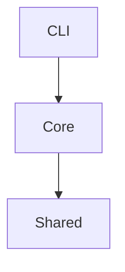

# Day 15：项目结构与模块依赖图

## 今日目标

训练从目录结构识别边界层、业务层、工具层，并画出一个小项目的模块依赖图。

## 90 分钟安排

| 时间 | 任务 | 说明 |
| ----- | ------ | -- |
| 15 分钟 | 概念学习 | 分层、模块边界、依赖方向 |
| 35 分钟 | 代码练习 | 重构项目 1 目录 |
| 25 分钟 | 源码阅读训练 | 分析一个项目目录结构 |
| 15 分钟 | 复盘笔记 | 画模块依赖图 |

## 必学知识点

1. 入口层负责接收输入和调用核心逻辑。
2. 业务层表达核心数据和流程。
3. 工具层提供可复用辅助函数。

## C 语言类比

C 项目也会分 `main.c`、业务模块、工具模块；TS 项目常通过目录和导入关系体现依赖边界。源码阅读时不要先看每行代码，先看模块职责。

## 代码练习

把项目 1 整理为：

```text
src/
  cli/
    index.ts
  core/
    task.ts
    stats.ts
    report.ts
  shared/
    list-utils.ts
```

要求 `cli/index.ts` 只负责准备输入和输出，`core` 负责类型和业务逻辑。

## 源码阅读训练

找一个小型 TS 项目目录，只做一件事：给每个顶层目录标注“入口层 / 业务层 / 工具层 / 配置层 / 测试层”。

## 当天产出

- 一个重构后的项目 1 目录。
- 一张模块依赖图。

## 常见坑

- 以文件名猜职责，不看 import 关系。
- 工具层反向依赖业务层。
- 入口层塞进太多业务逻辑。

## 过关标准

你能用 5 句话说明项目 1 的目录结构，并画出 `cli -> core -> shared` 的依赖关系。

## 有余力再做

用 Mermaid 写模块图：



