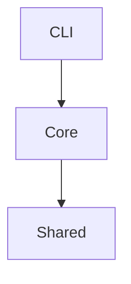

# Day 15：项目结构与模块依赖图

## 今日目标

今天训练源码阅读的结构感：不是读每一行，而是先识别项目分层和模块依赖。

你要学会把一个小项目拆成：

```text
入口层 -> 核心业务层 -> 工具层
```

## 90 分钟安排

| 时间 | 任务 | 说明 |
| ----- | ------ | -- |
| 15 分钟 | 概念学习 | 分层、模块边界、依赖方向 |
| 35 分钟 | 代码练习 | 重构项目 1 目录 |
| 25 分钟 | 源码阅读训练 | 分析一个项目目录结构 |
| 15 分钟 | 复盘笔记 | 画模块依赖图 |

## 必学知识点

1. 入口层负责接收输入和输出结果。
2. 核心层负责业务类型和业务函数。
3. 工具层提供通用辅助函数。

## 先讲清楚：为什么要分层

如果所有代码都在 `index.ts`，项目小的时候能跑，项目大了就难读。源码阅读最怕的是没有边界。

一个清晰结构：

```text
src/
  cli/
    index.ts
  core/
    task.ts
    stats.ts
    report.ts
  shared/
    list-utils.ts
```

翻译：

```text
cli：怎么启动、怎么输出
core：任务是什么、怎么统计
shared：通用列表工具
```

## C 语言类比

C 项目也会把 `main.c`、业务模块、工具模块分开。TS 项目通过目录和 import 关系体现依赖方向。

## 代码练习：重构项目 1

目标结构：

```text
src/
  cli/
    index.ts
  core/
    task.ts
    stats.ts
    report.ts
  shared/
    list-utils.ts
```

`cli/index.ts`：

```ts
import type { Task } from "../core/task.ts";
import { describeTask } from "../core/report.ts";

const tasks: Task[] = [
  { id: "T1", title: "draw module graph", status: "todo" },
];

console.log(tasks.map(describeTask));
```

要求：

```text
cli 只能调用 core 和 shared。
core 可以调用 shared。
shared 不应该依赖 core。
```

## 源码阅读训练：给目录贴标签

阅读这个目录：

```text
src/
  commands/
  config/
  core/
  tools/
  utils/
```

试着标注：

- `commands`：入口/命令层
- `config`：配置层
- `core`：核心业务层
- `tools`：工具调用层
- `utils`：通用工具层

源码阅读时，先给目录贴标签，再进入文件。

## 当天产出

- 重构后的项目 1 目录。
- 一张模块依赖图。
- 一段目录职责说明。

## 参考笔记示例

```md
# Day 15 模块图

cli/index.ts -> core/report.ts
core/report.ts -> core/task.ts
core/stats.ts -> shared/list-utils.ts

shared 不依赖 core，说明它是更底层的工具模块。
```

## 常见坑

- 只按文件名猜职责，不看 import。
- 工具层反向依赖业务层。
- 入口层塞进所有业务逻辑。
- 画图时没有箭头方向。

## 过关标准

你能用 5 句话说明项目 1 的目录结构，并画出至少 3 条模块依赖。

## 有余力再做

用 Mermaid 写图：



