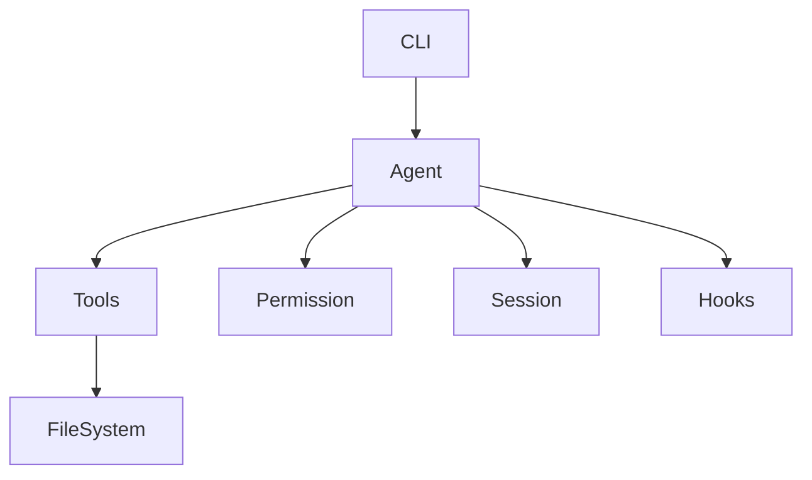

# Day 29：源码阅读方法论与笔记模板

## 今日目标

今天把前 28 天的方法收束成一套固定源码阅读流程。以后遇到 TypeScript + Node.js 项目，就按这套流程走。

## 90 分钟安排

| 时间 | 任务 | 说明 |
| ----- | ------ | -- |
| 15 分钟 | 概念学习 | 源码阅读十二步 |
| 35 分钟 | 代码练习 | 给 Mini Agent 画模块图 |
| 25 分钟 | 源码阅读训练 | 用十二步读一个小项目 |
| 15 分钟 | 复盘笔记 | 填写阅读笔记模板 |

## 源码阅读十二步

1. 看 README，确认项目用途。
2. 看 `package.json`，找到 scripts、bin、main、exports。
3. 找 `bin` / `main` / `exports` 指向的入口。
4. 看 `tsconfig`，确认模块系统和源码范围。
5. 找入口文件，不急着读所有文件。
6. 跑起来，记录最小运行命令。
7. 打断点或加日志，确认真实执行路径。
8. 找核心数据结构：type、interface、class。
9. 找核心流程：main、run、execute、loop。
10. 画调用链和模块依赖。
11. 写阅读笔记，标明已懂和未懂。
12. 用自己的话复述架构。

## C 语言类比

读 C 项目你会找 Makefile、main、头文件、核心结构体。读 TS/Node 项目则找 README、package.json、tsconfig、入口文件、核心类型。

## 代码练习：画 Mini Agent 模块图



把图翻译成文字：

```text
CLI 接收用户输入。
Agent 控制主流程。
Tools 执行具体能力。
Permission 在工具执行前做边界判断。
Session 记录历史。
Hooks 提供扩展点。
```

## 源码阅读训练：填模板

用项目 2 或项目 3 填这个模板：

```md
# 源码阅读笔记

## 项目用途

## 最小运行命令

## package.json 入口

## tsconfig 关键信息

## 入口文件

## 我今天追踪的问题

## 当前调用链

## 核心类型

## 我看懂了什么

## 我还没看懂什么

## 下一步追踪
```

## 当天产出

- 一套源码阅读方法论。
- 一份阅读笔记模板。
- Mini Agent 模块图。

## 参考笔记示例

```md
# mini-agent-cli 阅读笔记

用途：模拟 Agent CLI 主流程。
入口：src/cli.ts。
核心流程：cli -> agent -> permission -> tools -> session。
核心类型：AgentTask、AgentStep、Tool、ToolResult。
未懂：插件加载顺序。
下一步：追踪 hooks 注册和调用。
```

## 常见坑

- 一上来逐行读源码。
- 一次追踪多个问题。
- 不写“还没看懂什么”。
- 用 AI 解释前没有自己定位入口。

## 过关标准

你能按十二步流程读一个小项目，并产出结构化笔记。

## 有余力再做

把模板保存为 `source-reading-template.md`，以后每读一个项目都复制一份。

